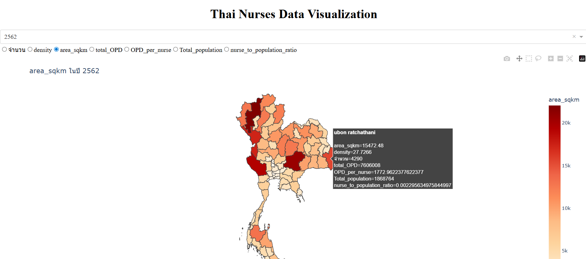

Thai Nurses Data Visualization Based on the Thailand Map.

In order to predict the number of nurses in the future using machine learning techniques, This project presents and visualizes several factors based on the map of Thailand.     

Many factors are related to the number of nurses. This repository describes several significant factors as follows : 

- Year         
- Number of Nurses      
- Density         
- Area (Square kilometers)         
- Total OPD (Outer Patient)       
- OPD per nurse       
- Total Population     
- Nurses to Population ratio        

Moreover, users can choose a specific year and a desired factor to visualize in each province. Clon this repository, and type `python3 app2.py` to run app locally.

